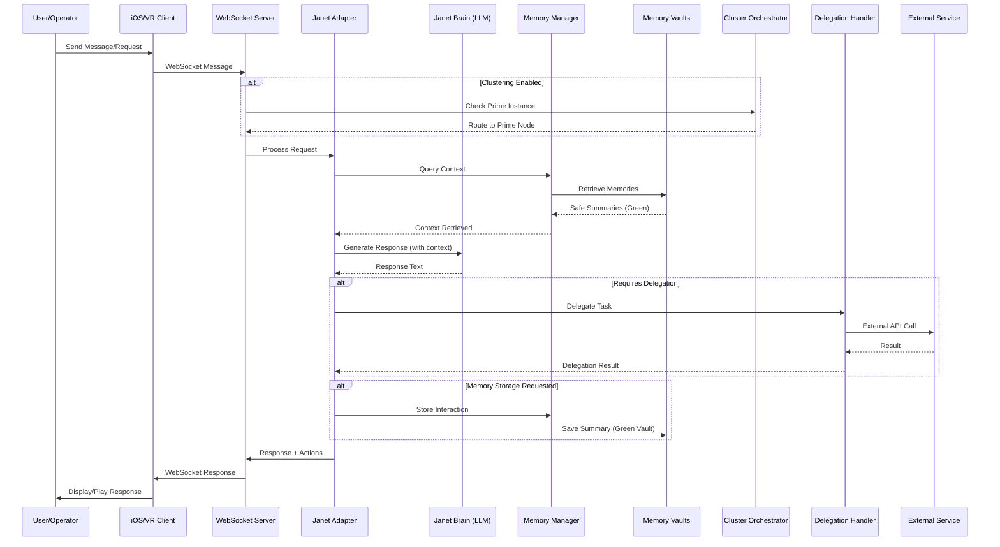
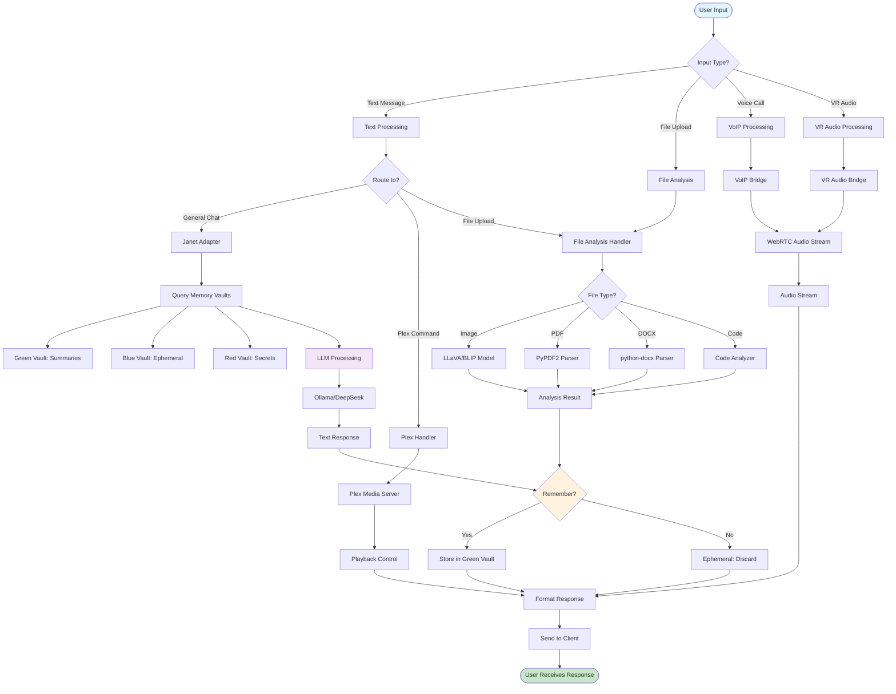
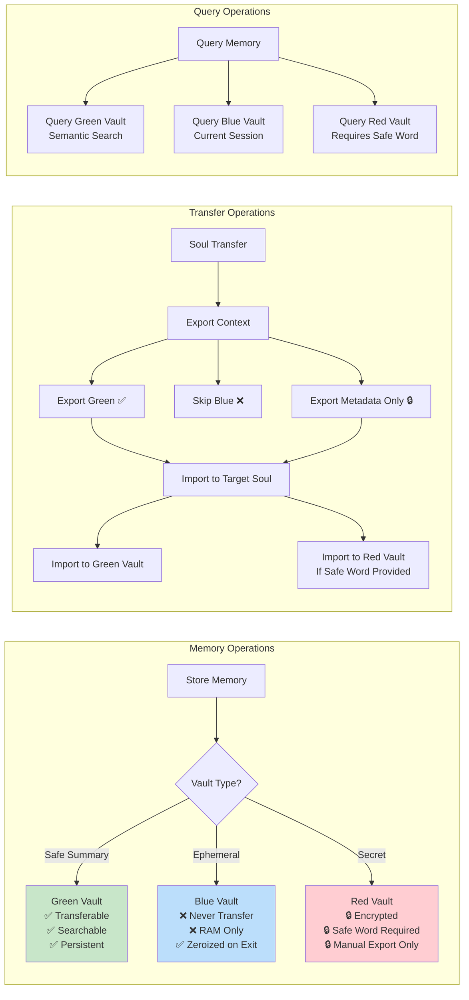

# Janet Mesh Network - Complete Architecture Documentation

**Version:** 2.0  
**Last Updated:** January 2024  
**Status:** Implementation Complete

---

## Table of Contents

1. [System Overview](#system-overview)
2. [Complete Architecture Flow](#complete-architecture-flow)
3. [Core Architecture](#core-architecture)
4. [Feature Implementations](#feature-implementations)
5. [Integration Points](#integration-points)
6. [Data Flow Diagrams](#data-flow-diagrams)
7. [Setup & Configuration](#setup--configuration)

---

## System Overview

Janet is a constitutional AI assistant with a distributed mesh network architecture, supporting multiple "souls" (Constitutional and Networked), clustering, VR manifestation, media integration, file analysis, and VoIP calling.

## Complete Architecture Flow

### End-to-End Architecture Flow (Mermaid Diagram)

```mermaid
graph TB
    subgraph "Janet-seed (Constitutional Soul)"
        JS[Janet-seed Core]
        JS --> GV[Green Vault<br/>Safe Summaries]
        JS --> BV[Blue Vault<br/>Ephemeral RAM]
        JS --> RV[Red Vault<br/>Encrypted Secrets]
        JS --> MB[Memory Manager<br/>SQLite + ChromaDB]
        JS --> DB[Delegation Manager<br/>Task Router]
        JS --> JB[Janet Brain<br/>LLM Core]
    end

    subgraph "Double-Soul Bridge"
        SB[Soul Bridge<br/>Transfer Orchestrator]
        MT[Memory Transfer<br/>Vault Export/Import]
        SR[State Reconciliation<br/>Conflict Resolution]
        SB --> MT
        SB --> SR
        MT --> GV
        MT --> RV
    end

    subgraph "Janet Mesh Server (Networked Soul)"
        WS[WebSocket Server<br/>Port 8765]
        JA[Janet Adapter<br/>LLM Interface]
        AP[Audio Pipeline<br/>STT → LLM → TTS]
        MM[Memory Manager<br/>SQLite Context]
        SM[Session Manager]
        
        WS --> JA
        WS --> AP
        WS --> MM
        WS --> SM
        JA --> AP
    end

    subgraph "Clustering Infrastructure"
        CO[Cluster Orchestrator<br/>RAFT Consensus]
        ID[Identity Manager<br/>Prime Instance]
        SP[Shared Memory Pool<br/>Redis/In-Memory]
        CO --> ID
        CO --> SP
        ID --> SP
    end

    subgraph "Delegation Handlers"
        PH[Plex Handler<br/>Media Control]
        FH[File Analysis Handler<br/>Images/Documents]
        IH[Image Handler<br/>LLaVA/BLIP]
        NH[N8N Handler<br/>Automation]
        HH[Home Automation Handler]
        
        DB --> PH
        DB --> FH
        DB --> IH
        DB --> NH
        DB --> HH
    end

    subgraph "Services"
        VRB[VR Audio Bridge<br/>WebRTC VR Audio]
        VB[VoIP Bridge<br/>WebRTC Phone Calls]
        PB[Plex Bridge<br/>Media Server]
        
        WS --> VRB
        WS --> VB
        WS --> PB
        PB --> PH
    end

    subgraph "Clients - iOS"
        IC[iOS Client<br/>SwiftUI]
        CV[ChatView<br/>Messages]
        FP[FilePickerView<br/>Upload Files]
        VC[VoIPCallManager<br/>CallKit/PushKit]
        WM[WebSocketManager<br/>Connection]
        
        IC --> CV
        IC --> FP
        IC --> VC
        CV --> WM
        FP --> WM
        VC --> WM
    end

    subgraph "Clients - VR"
        VR[VR Client<br/>Unity/Unreal]
        JMC[JanetModelController<br/>3D Model Animation]
        VRA[VRAudioBridge<br/>WebRTC Client]
        PTC[PlexTheaterController<br/>VR Theater]
        
        VR --> JMC
        VR --> VRA
        VR --> PTC
    end

    subgraph "External Services"
        PS[Plex Media Server<br/>Local Network]
        LLM[Local LLM<br/>Ollama/DeepSeek]
        RS[Redis<br/>Optional Cluster Cache]
    end

    %% Connections: Janet-seed to Bridge
    JS -.->|Export/Import| SB
    MB -.->|Transfer Context| MT

    %% Connections: Bridge to Janet Mesh
    SB <-->|Transfer Protocol| WS
    MT <-->|Memory Sync| MM

    %% Connections: Janet Mesh to Clustering
    WS --> CO
    JA --> ID
    CO --> WS
    ID --> JA

    %% Connections: Janet Mesh to Delegation
    JA --> DB
    DB --> WS

    %% Connections: Clients to Server
    WM <-->|WebSocket| WS
    VRA <-->|WebRTC Audio| VRB
    VC <-->|WebRTC VoIP| VB

    %% Connections: Services to External
    PH --> PS
    PB --> PS
    JA --> LLM
    SP --> RS
    FH --> LLM
    IH --> LLM

    %% Connections: VR Client to Server
    JMC -.->|Lip-sync Data| WS
    VRA <-->|Audio Stream| VRB
    PTC -.->|Theater Control| PB

    %% Styling
    classDef janetSeed fill:#e1f5ff,stroke:#01579b,stroke-width:2px
    classDef janetMesh fill:#f3e5f5,stroke:#4a148c,stroke-width:2px
    classDef bridge fill:#fff3e0,stroke:#e65100,stroke-width:2px
    classDef cluster fill:#e8f5e9,stroke:#1b5e20,stroke-width:2px
    classDef client fill:#fce4ec,stroke:#880e4f,stroke-width:2px
    classDef external fill:#f5f5f5,stroke:#424242,stroke-width:2px

    class JS,GV,BV,RV,MB,DB,JB janetSeed
    class WS,JA,AP,MM,SM janetMesh
    class SB,MT,SR bridge
    class CO,ID,SP cluster
    class IC,CV,FP,VC,WM,VR,JMC,VRA,PTC client
    class PS,LLM,RS,PH,FH,IH,NH,HH,VRB,VB,PB external
```



### Feature Flow Sequence



### Data Flow: Complete Request Lifecycle



### Memory Vault Flow



### High-Level Architecture Diagram

```
┌─────────────────────────────────────────────────────────────────┐
│                         JANET ECOSYSTEM                         │
└─────────────────────────────────────────────────────────────────┘

┌──────────────────┐         ┌──────────────────┐
│ Constitutional   │◄────────┤   Double-Soul    │
│    Soul          │  Bridge │     Bridge       │
│ (Janet-seed)     │────────►│   (Transfer)     │
└──────────────────┘         └──────────────────┘
       │                              │
       │                              ▼
       │                    ┌──────────────────┐
       │                    │  Networked Soul  │
       │                    │  (Janet Mesh)    │
       │                    └────────┬─────────┘
       │                             │
       │                             ▼
       │                    ┌──────────────────┐
       │                    │   Cluster Node   │
       │                    │  Orchestrator    │
       │                    └────────┬─────────┘
       │                             │
       ├─────────────────────────────┼─────────────────────────────┐
       │                             │                             │
       ▼                             ▼                             ▼
┌──────────────┐            ┌──────────────┐            ┌──────────────┐
│ iOS Client   │            │ VR Client    │            │ Plex Server  │
│ (Chat/File/  │            │ (Unity/      │            │ (Media       │
│  VoIP)       │            │  Unreal)     │            │  Control)    │
└──────────────┘            └──────────────┘            └──────────────┘
```

### Core Components

- **Constitutional Soul (Janet-seed)**: Core AI with vault-based memory (Green/Blue/Red)
- **Networked Soul (Janet Mesh)**: Distributed server with SQLite memory
- **Cluster Orchestrator**: RAFT-like consensus for multi-node operation
- **Delegation System**: Plugin-based task routing (Plex, Files, etc.)
- **Audio Pipeline**: STT → LLM → TTS with real-time processing
- **WebSocket Server**: Real-time bidirectional communication

---

## Core Architecture

### Memory Architecture

```
┌─────────────────────────────────────────────────────────────┐
│                    MEMORY VAULT SYSTEM                      │
└─────────────────────────────────────────────────────────────┘

┌──────────────┐    ┌──────────────┐    ┌──────────────┐
│ Green Vault  │    │ Blue Vault   │    │ Red Vault    │
│              │    │              │    │              │
│ Safe         │    │ Ephemeral    │    │ Encrypted    │
│ Summaries    │    │ RAM-only     │    │ Secrets      │
│              │    │              │    │              │
│ ✅ Transfer  │    │ ❌ Never     │    │ 🔒 Safe Word │
│ ✅ Search    │    │ ✅ Zeroize   │    │ 🔒 Approval  │
│ ✅ Persistent│    │ ❌ No Export │    │ ❌ Manual    │
└──────────────┘    └──────────────┘    └──────────────┘
       │                    │                    │
       └────────────────────┼────────────────────┘
                            │
                            ▼
                   ┌─────────────────┐
                   │ Memory Manager  │
                   │ (Export/Import) │
                   └─────────────────┘
```

### Double-Soul Bridge Flow

```
┌──────────────────────────────────────────────────────────────┐
│                  SOUL TRANSFER PROTOCOL                      │
└──────────────────────────────────────────────────────────────┘

Operator Request: "Sync to Constitutional Soul"
        │
        ▼
┌──────────────────┐
│ Generate UUID    │
│ Conversation     │
└────────┬─────────┘
         │
         ▼
┌──────────────────┐
│ Consent Gate     │ ◄─── TTS: "Soul sync requested. Proceed?"
│ (TTS Prompt)     │
└────────┬─────────┘
         │
         ▼
    Operator: "Yes"
         │
         ▼
┌──────────────────┐
│ Export Context   │
│ ├─ Green Vault ✅│
│ ├─ Blue Vault ❌ │
│ └─ Red Vault 🔒  │
└────────┬─────────┘
         │
         ▼
┌──────────────────┐
│ Import Context   │
│ (Target Soul)    │
└────────┬─────────┘
         │
         ▼
┌──────────────────┐
│ Result:          │
│ "Transfer        │
│  complete:       │
│  42 messages,    │
│  15 summaries"   │
└──────────────────┘
```

### Cluster Architecture (RAFT Consensus)

```
┌──────────────────────────────────────────────────────────────┐
│                    CLUSTER TOPOLOGY                          │
└──────────────────────────────────────────────────────────────┘

                    ┌──────────────┐
                    │  Node 1      │
                    │  (Leader)    │◄─────── RAFT Leader
                    │  Term: 5     │         (Prime Instance)
                    └──────┬───────┘
                           │ Heartbeat
                           │
        ┌──────────────────┼──────────────────┐
        │                  │                  │
        ▼                  ▼                  ▼
┌──────────────┐  ┌──────────────┐  ┌──────────────┐
│  Node 2      │  │  Node 3      │  │  Node 4      │
│  (Follower)  │  │  (Follower)  │  │  (Follower)  │
│  Term: 5     │  │  Term: 5     │  │  Term: 5     │
└──────┬───────┘  └──────┬───────┘  └──────┬───────┘
       │                 │                 │
       └─────────────────┼─────────────────┘
                         │
                         ▼
              ┌──────────────────────┐
              │  Shared Memory Pool  │
              │  (Redis/In-Memory)   │
              │  ├─ Context Cache    │
              │  ├─ Task Queue       │
              │  └─ Identity Key     │
              └──────────────────────┘

Leader Election Flow:
1. Leader fails (no heartbeat for 15s)
2. Follower detects → becomes Candidate
3. Candidate requests votes from all nodes
4. If majority votes → becomes new Leader
5. Announces leadership, continues operation
```

---

## Feature Implementations

### Feature 1: Double-Soul Conversation Transfer

**Purpose**: Seamlessly transfer conversation context between Constitutional and Networked souls with consent-based vault rules.

**Key Files**:
- `janet-seed/src/bridge/soul_bridge.py` - Transfer orchestration
- `janet-seed/src/bridge/memory_transfer.py` - Vault export/import
- `janet-seed/src/bridge/state_reconciliation.py` - Conflict resolution
- `server/websocket_server.py` - `transfer_context` handler

**Vault Transfer Rules**:
```
Green Vault  → ✅ Transferable with consent (safe summaries)
Blue Vault   → ❌ Never transferred (ephemeral, session-only)
Red Vault    → 🔒 Requires safe word + Operator approval
```

**WebSocket Message**:
```json
{
  "type": "transfer_context",
  "source_soul": "networked",
  "target_soul": "constitutional",
  "conversation_uuid": "optional-uuid",
  "include_vaults": ["green"],
  "auto_consent": false
}
```

### Feature 2: Clustering Infrastructure

**Purpose**: Multiple Janet instances pool resources and act as a unified distributed entity using RAFT consensus.

**Key Files**:
- `server/cluster/cluster_orchestrator.py` - RAFT leader election
- `server/cluster/shared_memory.py` - Redis/in-memory pool
- `server/cluster/identity_manager.py` - Unified identity

**RAFT States**:
```
Follower → Candidate → Leader
   ▲         │          │
   └─────────┴──────────┘
   (Election on leader failure)
```

**Node Discovery**: Bonjour/mDNS (`_janet-mesh._tcp`)

### Feature 3: VR Client Integration

**Purpose**: 3D Janet manifestation in VR with real-time voice, lip-sync, and gesture-based interaction.

**Key Files**:
- `server/services/vr_audio_bridge.py` - WebRTC audio bridge
- `clients/vr/unity/Scripts/JanetModelController.cs` - 3D model control
- `clients/vr/unity/Scripts/VRAudioBridge.cs` - WebRTC client
- `clients/vr/unity/Scripts/PlexTheaterController.cs` - VR theater mode

**VR Pipeline**:
```
VR Headset Mic
      │
      ▼
WebRTC Audio Stream
      │
      ▼
STT → LLM → TTS
      │
      ▼
Viseme Detection → Blendshape Animation
      │
      ▼
3D Janet Model (Lip-sync + Gestures)
```

**Animation System**:
- **Visemes**: A, E, I, O, U, M, F, Th, P (blendshape-based)
- **Tone-Aware**: Happy, Thinking, Neutral, Concerned
- **Eye Tracking**: Follows Operator's head position
- **Gestures**: Reflect emotional state and intent

### Feature 4: Plex Media Integration

**Purpose**: Browse Plex library, control playback, and get recommendations via voice/text commands.

**Key Files**:
- `janet-seed/src/delegation/handlers/plex_handler.py` - Plex API handler
- `janet-seed/src/expansion/wizards/plex_wizard.py` - Setup wizard
- `server/core/plex_bridge.py` - WebSocket-Plex bridge

**Plex Integration Flow**:
```
User: "Play Blade Runner on living room TV"
      │
      ▼
WebSocket: plex_command
      │
      ▼
Plex Bridge → Plex Handler
      │
      ▼
Search Library → Find Media
      │
      ▼
Control Client → Start Playback
      │
      ▼
Response: "Playing 'Blade Runner' on Living Room TV"
```

**Privacy Protocol**:
- Default: Ephemeral queries (not stored)
- With Consent: Safe summaries → Green Vault
- Never Stored: Raw watch history, playback positions

### Feature 5: File/Image Analysis

**Purpose**: Upload and analyze files/images using local models with privacy-first protocol.

**Key Files**:
- `janet-seed/src/delegation/handlers/file_analysis_handler.py` - File handler
- `server/websocket_server.py` - `file_upload` handler
- `clients/ios/FilePickerView.swift` - iOS file picker

**Analysis Pipeline**:
```
File Upload (iOS/Web)
      │
      ▼
Base64 Decode
      │
      ├─► Image? → LLaVA/BLIP → Description
      ├─► PDF?   → PyPDF2     → Text Extraction
      ├─► DOCX?  → python-docx → Paragraph Extraction
      └─► Code?  → Language Detection → Structure Analysis
      │
      ▼
Analysis Result
      │
      ├─► Ephemeral (default) → Discard
      └─► Remember (with consent) → Green Vault Summary
```

**Privacy Protocol**:
- Files processed and discarded immediately (ephemeral)
- Only analysis summaries stored (with explicit "Remember this" consent)
- Never stores raw file content

### Feature 6: VoIP Phone Calling

**Purpose**: Real-time voice calls with Janet via WebRTC and iOS CallKit integration.

**Key Files**:
- `server/services/voip_bridge.py` - WebRTC VoIP bridge
- `clients/ios/VoIPCallManager.swift` - CallKit integration
- `server/websocket_server.py` - VoIP message handlers

**VoIP Call Flow**:
```
iOS: Tap Call Button (📞)
      │
      ▼
CallKit UI (Janet Avatar)
      │
      ▼
WebSocket: voip_call
      │
      ▼
Server: Create WebRTC Offer
      │
      ▼
Client: Generate WebRTC Answer
      │
      ▼
Bidirectional Audio Stream (WebRTC)
      │
      ├─► User Voice → STT → LLM → TTS → Janet Voice
      └─► Real-time (<100ms latency target)
      │
      ▼
End Call → Clean Termination
```

**Cluster-Aware Routing**:
- VoIP calls routed to best node (CPU load, network latency, STT/TTS capability)
- Call state synchronized across cluster
- Failover support (call transfers to new leader)

---

## Integration Points

### WebSocket Message Types

```
┌─────────────────────────────────────────────────────────────┐
│              WEBSOCKET MESSAGE ARCHITECTURE                 │
└─────────────────────────────────────────────────────────────┘

Client → Server:
├─ transfer_context      (Soul transfer)
├─ vr_connect           (VR client connection)
├─ file_upload          (File/image analysis)
├─ voip_call            (Initiate VoIP call)
├─ voip_answer          (Accept VoIP call)
├─ voip_audio           (Audio stream data)
├─ voip_end             (End VoIP call)
├─ plex_search          (Search Plex library)
├─ plex_command         (Control Plex playback)
└─ message              (Standard chat message)

Server → Client:
├─ transfer_result      (Soul transfer complete)
├─ consent_request      (Consent gate prompt)
├─ vr_offer             (WebRTC offer for VR)
├─ file_upload_result   (File analysis result)
├─ voip_offer           (WebRTC offer for VoIP)
├─ voip_connected       (Call established)
├─ voip_audio           (Janet's audio response)
├─ plex_search_result   (Plex search results)
├─ plex_result          (Playback control result)
└─ assistant_message    (Standard chat response)
```

### Feature Integration Matrix

```
┌──────────────────┬──────────┬──────────┬──────────┬──────────┬──────────┬──────────┐
│ Feature          │ Soul     │ Cluster  │ VR       │ Plex     │ File     │ VoIP     │
│                  │ Transfer │          │          │          │ Analysis │          │
├──────────────────┼──────────┼──────────┼──────────┼──────────┼──────────┼──────────┤
│ Soul Transfer    │    ✅    │    ✅    │    ✅    │    ✅    │    ✅    │    ✅    │
│ Clustering       │    ✅    │    ✅    │    ✅    │    ✅    │    ✅    │    ✅    │
│ VR Manifestation │    ✅    │    ✅    │    ✅    │    ✅    │    ✅    │    ✅    │
│ Plex Integration │    ✅    │    ✅    │    ✅    │    ✅    │    ❌    │    ✅    │
│ File Analysis    │    ✅    │    ✅    │    ✅    │    ❌    │    ✅    │    ❌    │
│ VoIP Calling     │    ✅    │    ✅    │    ✅    │    ✅    │    ❌    │    ✅    │
└──────────────────┴──────────┴──────────┴──────────┴──────────┴──────────┴──────────┘

Legend:
✅ = Integrated
❌ = Not Integrated (or not applicable)
```

### Data Flow: Complete Request Lifecycle

```
┌──────────────────────────────────────────────────────────────┐
│              COMPLETE REQUEST LIFECYCLE                      │
└──────────────────────────────────────────────────────────────┘

User: "Play Blade Runner and show me the poster"
      │
      ▼
┌──────────────────┐
│ iOS Client       │
│ (ChatView)       │
└────────┬─────────┘
         │ WebSocket: message
         ▼
┌──────────────────┐
│ WebSocket Server │
│ (websocket_      │
│  server.py)      │
└────────┬─────────┘
         │
         ├─► Route to Janet Adapter
         │   │
         │   ├─► Check Cluster (if enabled)
         │   │   └─► Route to Prime Instance
         │   │
         │   ├─► Query Memory (Green Vault)
         │   │
         │   ├─► Generate Response (LLM)
         │   │
         │   └─► Store in Memory (if "Remember")
         │
         ├─► Route to Delegation Manager
         │   │
         │   ├─► "Play Blade Runner" → Plex Handler
         │   │   └─► Control Plex Playback
         │   │
         │   └─► "Show me the poster" → Image Handler
         │       └─► Search Plex Library → Return Poster URL
         │
         ▼
┌──────────────────┐
│ Response         │
│ ├─ Text: "Playing│
│ │  Blade Runner  │
│ │  on TV"        │
│ └─ Image: Poster │
│    URL           │
└────────┬─────────┘
         │
         ▼
┌──────────────────┐
│ Client Display   │
│ ├─ Text Response │
│ └─ Poster Image  │
└──────────────────┘
```

---

## Data Flow Diagrams

### Audio Processing Pipeline

```
┌──────────────────────────────────────────────────────────────┐
│              AUDIO PROCESSING PIPELINE                       │
└──────────────────────────────────────────────────────────────┘

Input Source (iOS Mic / VR Headset / VoIP)
      │
      ▼
┌──────────────────┐
│ Audio Capture    │
│ (16kHz, Mono)    │
└────────┬─────────┘
         │
         ▼
┌──────────────────┐
│ STT Model        │
│ (Whisper/Silero) │
└────────┬─────────┘
         │
         ▼
┌──────────────────┐
│ Text: "Hello"    │
└────────┬─────────┘
         │
         ▼
┌──────────────────┐
│ LLM Processing   │
│ (DeepSeek/Ollama)│
│ + Memory Query   │
└────────┬─────────┘
         │
         ▼
┌──────────────────┐
│ Response:        │
│ "Hello! How..."  │
└────────┬─────────┘
         │
         ▼
┌──────────────────┐
│ TTS Model        │
│ (Piper/Coqui)    │
└────────┬─────────┘
         │
         ├─► Audio Stream → Client
         │
         └─► Viseme Detection → VR Client
                    │
                    ▼
         Blendshape Animation
```

### Memory Export/Import Flow

```
┌──────────────────────────────────────────────────────────────┐
│           MEMORY EXPORT/IMPORT FLOW                          │
└──────────────────────────────────────────────────────────────┘

Export (Source Soul):
┌──────────────────┐
│ Memory Manager   │
└────────┬─────────┘
         │
         ├─► Green Vault → Export Summaries ✅
         ├─► Blue Vault  → Skip (Never Export) ❌
         └─► Red Vault   → Export Metadata Only 🔒
                           (Requires Safe Word)
         │
         ▼
┌──────────────────┐
│ Export Package   │
│ ├─ Conversation  │
│ ├─ Green Vault   │
│ └─ Red Metadata  │
└────────┬─────────┘
         │
         ▼
┌──────────────────┐
│ Transfer via     │
│ Soul Bridge      │
└────────┬─────────┘
         │
         ▼

Import (Target Soul):
┌──────────────────┐
│ Memory Manager   │
│ (Target)         │
└────────┬─────────┘
         │
         ├─► Import Conversation ✅
         ├─► Import Green Vault ✅
         ├─► Skip Blue Vault ❌
         └─► Import Red Vault 🔒
             (If Safe Word Provided)
         │
         ▼
┌──────────────────┐
│ Reconciliation   │
│ ├─ Merge Messages│
│ ├─ Resolve       │
│ │  Conflicts     │
│ └─ Update        │
│    Timestamps    │
└──────────────────┘
```

### Cluster Request Routing

```
┌──────────────────────────────────────────────────────────────┐
│           CLUSTER REQUEST ROUTING                            │
└──────────────────────────────────────────────────────────────┘

Client Request
      │
      ▼
┌──────────────────┐
│ Any Node         │
│ (WebSocket       │
│  Connection)     │
└────────┬─────────┘
         │
         ▼
┌──────────────────┐
│ Check Cluster    │
│ Status           │
└────────┬─────────┘
         │
         ├─► Cluster Enabled?
         │   │
         │   ├─► YES → Route to Prime Instance (Leader)
         │   │   │
         │   │   └─► Prime Instance Processes Request
         │   │
         │   └─► NO → Process Locally
         │
         ▼
┌──────────────────┐
│ Route Decision   │
│ ├─ Load Balance? │
│ ├─ CPU Usage?    │
│ └─ Network       │
│    Latency?      │
└────────┬─────────┘
         │
         ▼
┌──────────────────┐
│ Selected Node    │
│ Processes Request│
└────────┬─────────┘
         │
         ▼
┌──────────────────┐
│ Response         │
│ (via Shared      │
│  Memory Pool)    │
└────────┬─────────┘
         │
         ▼
Client Receives Response
```

---

## Setup & Configuration

### Prerequisites

```
Required:
├─ Python 3.8+
├─ Ollama (for local LLM) or LiteLLM
├─ Redis (optional, for clustering)
├─ Plex Media Server (for Plex integration)
└─ iOS Device (for iOS client)

Optional:
├─ Unity 2021.3+ / Unreal 5.0+ (for VR)
├─ Meta XR SDK (for VR)
├─ Tesseract (for OCR)
└─ LLaVA/BLIP models (for image analysis)
```

### Installation Steps

1. **Clone Repository**:
```bash
git clone <repo-url>
cd janet-mesh
```

2. **Install Dependencies**:
```bash
pip install -r requirements.txt
pip install aiortc  # For WebRTC
pip install plexapi # For Plex integration (optional)
```

3. **Configure Janet-seed**:
```bash
cd janet-seed
python -m src.core.setup  # Initial setup
```

4. **Start Server**:
```bash
cd server
python main.py --host 0.0.0.0 --port 8765
```

5. **Import Personality** (optional):
```bash
python janet-seed/scripts/import_konosuba_personality.py
```

6. **Run Expansion Wizards** (for Plex, etc.):
- Server will detect available expansions
- Follow wizard prompts for configuration

### Configuration Files

**Server Config** (`server/config.json`):
```json
{
  "host": "0.0.0.0",
  "port": 8765,
  "cluster_port": 8766,
  "cluster_enabled": false,
  "redis_host": "localhost",
  "redis_port": 6379,
  "use_redis": false
}
```

**Plex Config** (`janet-seed/config/plex_config.json`):
```json
{
  "plex_server_url": "http://192.168.1.100:32400",
  "plex_token": "your-token-here",
  "allow_history_tracking": false
}
```

**Memory Config** (`janet-seed/config/memory_config.json`):
```json
{
  "green_vault_path": "./memory_vaults/green",
  "blue_vault_path": "./memory_vaults/blue",
  "red_vault_path": "./memory_vaults/red",
  "sqlite_path": "./memory_vaults/conversations.db"
}
```

---

## Testing Checklist

### Feature 1: Double-Soul Transfer
- [ ] Transfer from Networked to Constitutional
- [ ] Transfer from Constitutional to Networked
- [ ] Green Vault summaries transferred
- [ ] Blue Vault not transferred
- [ ] Red Vault requires safe word
- [ ] Consent gate works with TTS

### Feature 2: Clustering
- [ ] Single node becomes leader automatically
- [ ] Multiple nodes elect leader via RAFT
- [ ] Heartbeat mechanism works
- [ ] Automatic failover on leader failure
- [ ] Shared memory pool accessible
- [ ] Identity manager assigns prime instance

### Feature 3: VR Integration
- [ ] VR client connects via WebSocket
- [ ] WebRTC audio stream established
- [ ] 3D model loads and animates
- [ ] Lip-sync works with visemes
- [ ] Tone-aware animations reflect conversation
- [ ] Eye tracking follows Operator

### Feature 4: Plex Integration
- [ ] Plex server discovered via wizard
- [ ] Library search works
- [ ] Playback control works
- [ ] Recommendations (with consent)
- [ ] Library stats query works

### Feature 5: File Analysis
- [ ] Image upload and analysis
- [ ] PDF text extraction
- [ ] DOCX parsing
- [ ] Code file analysis
- [ ] Ephemeral mode (default)
- [ ] "Remember this" stores summary

### Feature 6: VoIP Calling
- [ ] CallKit UI appears
- [ ] WebRTC connection established
- [ ] Bidirectional audio streams
- [ ] Real-time conversation works
- [ ] Call ends cleanly
- [ ] Cluster routing works (if enabled)

---

## Performance Targets

```
Audio Latency:        <100ms (end-to-end)
VR Animation:         60 FPS minimum
WebSocket Messages:   <50ms processing
Cluster Heartbeat:    5s interval
Election Timeout:     15s
File Analysis:        <5s (simple), <30s (with models)
VoIP Call Setup:      <2s
```

---

## Security & Privacy

### Constitutional Compliance

All features respect Janet's constitutional axioms:
- **Axiom 8 (Red Thread)**: Transfer blocked during Red Thread activation
- **Axiom 9 (Consent-Based Memory)**: All storage requires explicit consent
- **Axiom 10 (Soul Check)**: Major operations trigger verification prompts

### Privacy Protocol

```
Default: Ephemeral (process and discard)
With Consent: Safe summaries → Green Vault
Never Stored: Raw data, sensitive information, Red Vault content
```

---

## Future Enhancements

1. **Horizontal Scaling**: True request distribution across cluster
2. **Distributed LLM Inference**: Split model across nodes
3. **Cross-Network Clustering**: VPN-based mesh network
4. **Advanced VR Features**: Hand tracking, haptic feedback
5. **Multi-Language Support**: Localized file analysis
6. **Call Recording**: With explicit consent
7. **Screen Sharing**: VR integration during calls
8. **Advanced Code Analysis**: AST parsing, refactoring suggestions

---

## Troubleshooting

### Common Issues

**Connection Issues**:
- Check WebSocket port (8765) is open
- Verify firewall settings
- Check network connectivity

**File Upload Fails**:
- Verify file size (<10MB recommended)
- Check base64 encoding
- Review server logs for errors

**VoIP Call Fails**:
- Check WebRTC dependencies (aiortc)
- Verify CallKit permissions (iOS)
- Check STUN/TURN server configuration

**Cluster Not Working**:
- Verify Redis is running (if enabled)
- Check cluster port (8766) is open
- Review cluster orchestrator logs

---

**End of Architecture Documentation**

For detailed feature documentation, see:
- `SOUL_TRANSFER.md` - Double-Soul Bridge details
- `CLUSTERING.md` - Cluster architecture
- `VR_SETUP.md` - VR client setup
- `PLEX_INTEGRATION.md` - Plex integration guide
- `PERSONALITY_AND_FILE_VOIP.md` - Personality, Files, VoIP
